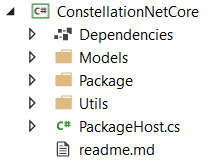
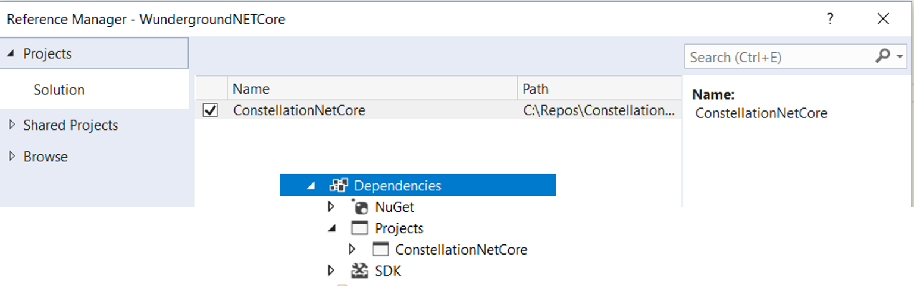

# .NET Core 2.0 Constellation SDK
Constellation is a real time communication platform which allows anything (objects, applications, webpages, etc) to send messages, publish object states and subscribe to changes. This platform is based on SignalR and provide REST API as well. The platform does as well allow package (names of applications in constellation) to be deployed fully automatically and transparently as well as managing settings for the application. In short, a service is running and takes care of the plumbing, download packages, install and run them in a user context. The platform is fully functional on Windows as well on Linux for both the server and the client side. Requirement are Mono as the core service is written in C#. 

As I wrote previously, the platform offers as well REST API allowing very light clients like Arduino, ESP8266 and other light devices to connect, register to state objects, messages, send messages, receive them, receive settings, manage some of the services. SDK are available for Arduino plateformes for example. The communication is classically secured using keys for access as well as https. Still http protocole can be used for simple at home wifi connected devices.

More information and details about the [Constgellation platform available here](https://developer.myconstellation.io/plateforme/).

Usage of the Consteallation plateform is free for home usage and eduction, a royalty is necessary for enterprise usage. I personaly use this platform at home and couple of remote places, connecting all my home and familly places thru smart services running on various devices from my own Windows server, Windows PC client, embedded devices like ESP8266, RaspberryPi on Linux, as well as VM running in Azure. I use it to manage dynamically my DNS, sending automated pictures of various Webcams, sending SMS notifications and more! I use it in complement of Microsoft Azure and as an Azure IoT gateway for some simple devices. Possibilities are unlimited, Constellation and Azure are the best ever couple!

A .NET Core SDK was missing in the list, so as I'm using some RaspberryPi running Linux and already existing .NET Core application, I've decided to port the native .NET SDK to .NET Core using the REST API. It does alllow to ru in a light way on low end ARM Linux devices or directly on ASP.NET Core pages. As I am quite intensively using the plateform, I wanted to have most of the code shared across my .NET projects. So my efforts mainly focussed on the PackageHost class which is the core class used when developing packages for Constellation. This allow to share code with any other compenent which would run on the native .NET plateform. Function coverage is close to 90% and only few features are not available. See the limitation section for more information.  

## How to use the .NET Core SDK
Just download the sources and add them to your project



Be aware that it does require the nuget package NewtonwSoft.Json.
Add the reference to the ConstellationNetCore to your own roject and you're good to go.



## Beginning with Constellation
Just follow the excellent documentation on https://developer.myconstellation.io. A good page to start is is [here](https://developer.myconstellation.io/getting-started/creez-votre-premier-package-constellation-en-csharp/). Please read the section on limitation to understand what is not supported from the full managed Constellation plateform.

## specificities and limiation of the .NET Core Consteallion SDK
As already previously explained, the SDK is based on the Constellation REST API. They do not allow to have the full feature of automatic package deployment. So you'll have to use virtual packages. The principle is  describe in the documentation. Once you have [created a virtual package](https://developer.myconstellation.io/concepts/sentinels-packages-virtuels/), please note the access key, sentinel name and package name.

### Constelation connection keys 
Always start your code with setting up the key elements you'll need. It is one of the main difference with the full .NET Constellation SDK. In the .NET Core version, those elements needs to be part of the package code. You can as well store them on an XML or Json file and load them. But they have to be before the ```PackaHost.Start``` function.

```C#
class MyconstellationClass : PackageBase
{
    static void Main(string[] args)
    {
        PackageHost.AccessKey = "mysupersecretkey";
        PackageHost.isHttps = false; //can be true as well
        PackageHost.PackageName = "WeatherAndGreenhouse";
        PackageHost.Port = "8088";
        PackageHost.SentinelName = "RPI";
        //PackageHost.ServerName = "www.monserver.net";
        PackageHost.ServerName = "192.168.1.2";

        PackageHost.Start<MyconstellationClass>();
        //Do tons of things
    }
}
``` 

### State Objects 
State objects are fully supported as well, definition, pushing, purging and subscribing to changes.
Declaring a StateObjectNotifier allowing to be notify in case its state is changing is done exactly like you would do in the full .NET SDK:
```C#
[StateObjectLink("CellarESP", "WeatherAndGreenhouse", "*")]
static public StateObjectNotifier myWeather { get; set; }
```
Adding events exactly the same as well, all events are fully supported:
```C#
//usually declare it in the Main function
myWeather.ValueChanged += MyWeather_ValueChanged;

// the function handling the event
private static void MyWeather_ValueChanged(object sender, StateObjectChangedEventArgs e)
{
    var ret = e.NewState.Value;            
    Console.WriteLine($"Weather: {ret} and is it new {e.IsNew}, {e.NewState.LastUpdate}");
}
```
Declaring type of StateObject is as well fully supported. They'll be automatically declare on the main Constellation.
```C#
[StateObject]
public class TempHum
{
    public float Temp { get; set; }
    public float Hum { get; set; }
}
```

### Message callbacks
Message callbacks are fully supported and you can then declare them directly with the attribute ```MessageCallback```. The function will be then automatically exposed in the Constellation and visible from any other constellation package as well from the console. You can test the call of the function from the console.

```C#
[MessageCallback]
public void PostSomething(int ToPost, int Second)
{
    Console.WriteLine($"Postsomething {ToPost} and {Second}");
    PackageHost.PushStateObject("TempHum", ToPost, "RPI.TempHum");
}
```

So far messages part of Saga or sending an answer has not been fully tested. If you want the support of those scenarios, please refer to the source code and run tests. Do not hesitate to do pull request in case of problem.

Subscribing to group is as well fully supported.

Calling a message is as well supported but only thru the standard way. The dynamic way is not supported. You can as well create complex type in the call, all is fully supported.

```C#
//Send message with standard method
PackageHost.SendMessage(MessageScope.Create("WeatherAndGreenhouse"), "PostSomething", new object[] { ToPost as System.Int32, Second as System.Int32 }); 
```
### Writing logs
This is fully supported as well
```C#
// Write log
PackageHost.WriteLog(LogLevel.Info, "this is an info");
PackageHost.WriteInfo("From .NET core 2.0, My format with a crutial data: {0}", "crutial data");
PackageHost.WriteError("From .NET core 2.0, AAAAAAAAAAAAAAAAAAAAAA ERRRRRRROOOORRRRR");
PackageHost.WriteWarn("From .NET core 2.0, Bip bip warning {0}", 42);
```

### Settings
All features you're used to have with the full .NET SDK are supported including the events. You can fully enjoy them.
```C#
// Getting settings
var str = PackageHost.GetSettingValue("Number"); 
```

## Compiling and deploying your package
Just like any other .NET Core application, I recommend to use a command line or a PowerShell to build the application especially if it's for a specific platform.
Go to the main directory and simply do a ```dotnet restore``` then ```dotnet publish -r linux-arm``` to build your .NET Core application for a Linuw ARM platform.
The ready to deploy code for your RaspberryPi is located in ```\bin\Debug\netcoreapp2.0\linux-arm\publish```. You can copy the full directory and paste it on your RaspberryPi running Linux. Nothing else is required! you can run your application directly with ./nameofyourapp (nameofyourapp is the actual name of your application)

## Other usage
This .NET Core SDK is the most portable code that you can have to access Constellation using C#. You can include it into a Xamarin application, or on C# Standard application, in an ASP.NET web page or even in the normal .NET framework. It does offer a light library, very portable and facilitate the reuse of code already written for the full .NET SDK. 

